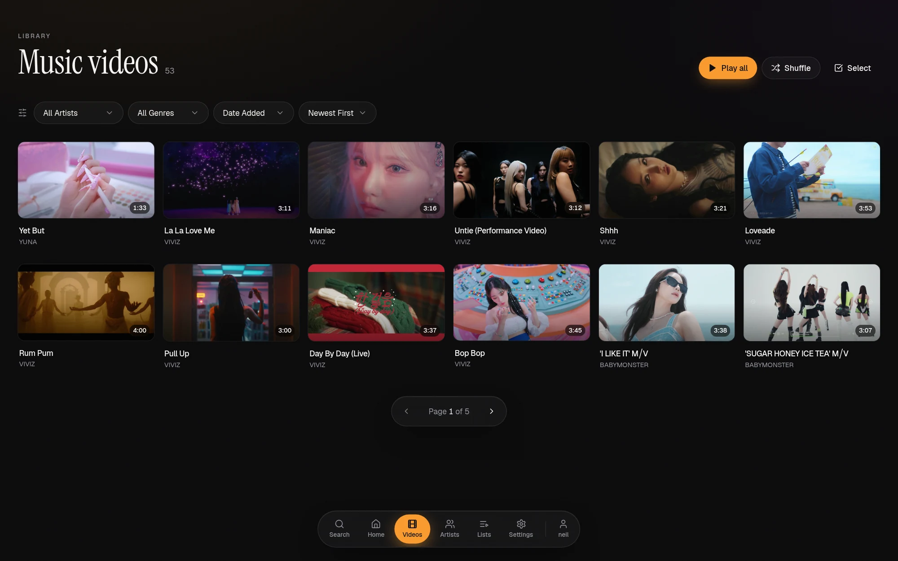
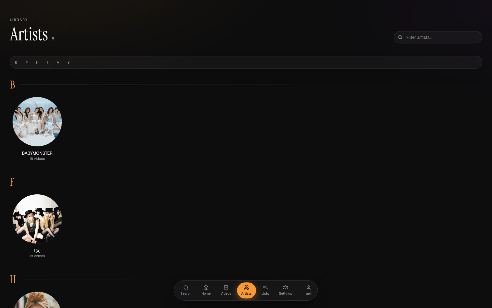
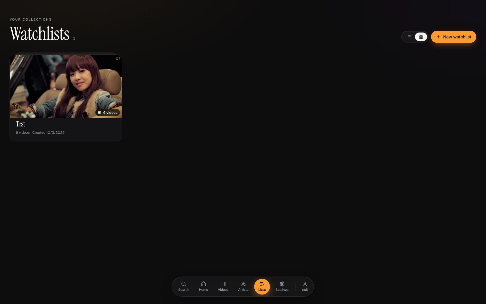
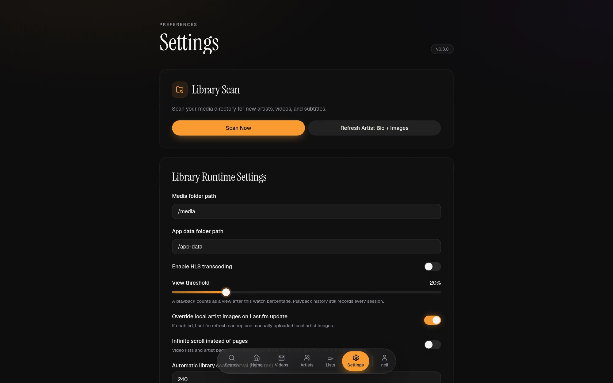
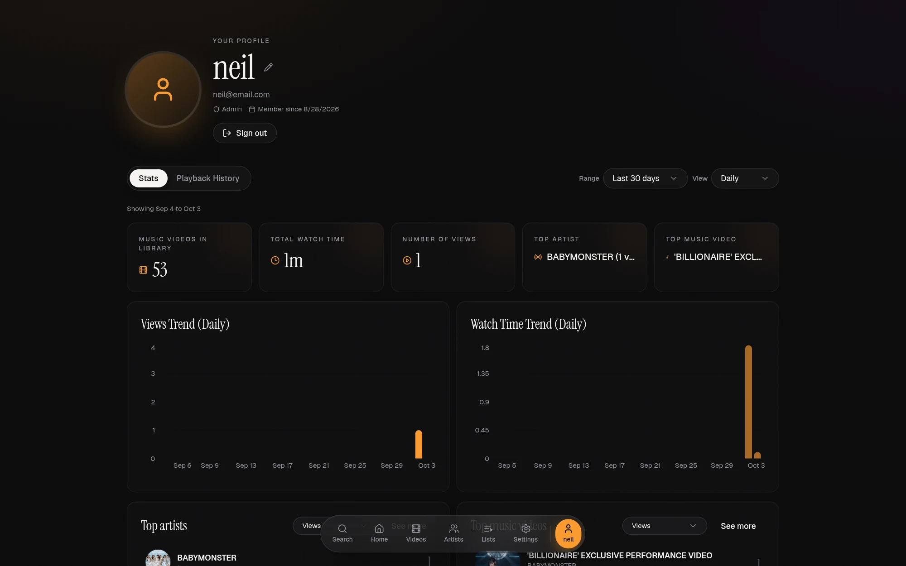

# Popinn

A self-hosted music-video library. Point it at a folder of music videos and it
builds a browsable library — artists, artwork, thumbnails, hover previews,
watchlists, play history and in-browser playback with transcoding for formats
your browser cannot handle natively.

Popinn runs entirely on your own hardware. Nothing is uploaded anywhere, and the
only outbound calls are the optional Last.fm, Spotify and MusicBrainz lookups
used to enrich artist and track metadata.

---

## Screenshots


| | |
| --- | --- |
| <br>**Home** | <br>**Music videos** |
| <br>**Artists** | <br>**Watchlists** |
| <br>**Settings** | <br>**Profile & stats** |

---

## Features

**Library**

- Scans a media folder into artists and videos, supporting both a flat
  (`Artist/Track.mkv`) and a nested (`Artist/Track/Track.mkv`) layout
- Reads duration and file size with `ffprobe`; generates thumbnails and short
  muted hover-preview clips with `ffmpeg`
- Picks up sidecar `.srt` / `.vtt` subtitles and serves them as WebVTT
- Rescans incrementally, with live progress and cancellable jobs
- Soft deletion, so removing something in the UI never touches your files

**Playback**

- On-demand HLS transcoding for everything else — VP9-in-Matroska, for example,
  which Chrome and Firefox refuse to play as a plain file
- Play history with a configurable "counts as a view" threshold

**Metadata**

- Artist biographies and images from Last.fm
- Track metadata lookup via Spotify (needs a Premium subscription) or MusicBrainz (no account needed)
- Manual overrides for everything, plus per-artist image upload

**Organisation**

- Per-user watchlists
- Search across artists and videos
- Personal statistics and rankings

---

## Quick start

**Requirements:** Docker or Podman with Compose, and a folder of music videos.

```bash
git clone https://github.com/beeetfarmer/Popinn.git
cd Popinn
cp .env.example .env
```

Edit `.env` and set at minimum:

```ini
POSTGRES_PASSWORD=<something long and random>
SECRET_KEY=<something long and random>
POPINN_MEDIA_PATH=/path/to/your/music-videos
WEB_PORT=8080
```

Generate the two secrets with:

```bash
python3 -c 'import secrets; print(secrets.token_urlsafe(48))'
```

Then bring it up:

```bash
docker compose --env-file .env -f docker-compose.yml up -d
```

Open <http://localhost:8080> and register. The first account becomes the
administrator. Then go to **Settings → Scan Library** to index your media.

> **Podman users:** rootless Podman needs
> `POPINN_USERNS=keep-id:uid=10001,gid=10001` in `.env`, or the backend cannot
> write thumbnails. Docker users must leave `POPINN_USERNS=` empty.
> [Installation](docs/installation.md) explains why.

---

## Documentation

| Document                                   | What it covers                                                |
| ------------------------------------------ | ------------------------------------------------------------- |
| [Installation](docs/installation.md)       | Deployment, compose files, storage layout, upgrades, backups   |
| [Configuration](docs/configuration.md)     | Every environment variable and runtime setting                 |
| [Media library](docs/media-library.md)     | Folder conventions, naming, subtitles, how scanning works      |
| [Architecture](docs/architecture.md)       | Components, data model, request flow, background jobs          |
| [API reference](docs/api.md)               | Endpoints, authentication, streaming                           |
| [Development](docs/development.md)         | Running locally, tests, the CI gate, the release process       |
| [Troubleshooting](docs/troubleshooting.md) | Permissions, playback, memory and scanning problems            |

---

## Security

If you find a vulnerability, please open a private security advisory on the
repository rather than a public issue.

---

## License

Popinn is free software, licensed under the **GNU Affero General Public License
v3.0**. You may use, study, share and modify it.

If you distribute a modified version, that version must also be released under
the AGPL v3 with its source available. Because this is the *Affero* GPL, the
same applies if you run a modified version as a network service: your users must
be offered its source, even though you never handed them a copy.

Running Popinn unmodified for yourself, your family or your organisation carries
no obligations at all.

See [LICENSE](LICENSE) for the full text.
